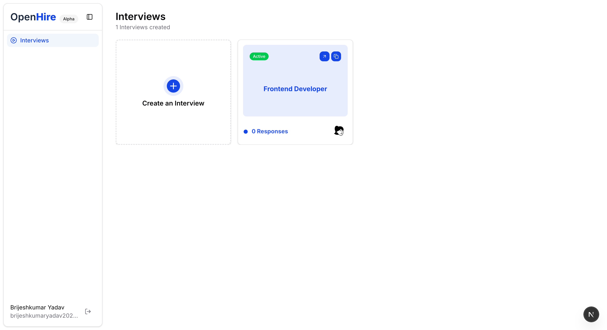

# Openhire

Open-source AI interviewing platform. Self-hosted.


[](https://github.com/brijeshmarch16/openhire)


## Features
- 🎯 **Interview Creation:** Instantly generate tailored interview questions from any job description.
- 🔗 **One-Click Sharing:** Generate and share unique interview links with candidates in seconds.
- 🎙️ **AI Voice Interviews:** Let our AI conduct natural, conversational interviews that adapt to candidate responses.
- 📊 **Smart Analysis:** Get detailed insights and scores for each interview response, powered by advanced AI.
- 📈 **Comprehensive Dashboard:** Track all candidate performances and overall stats.


## Documentation

### Quickstart

1. **Clone the repo and copy the env template**

```bash
git clone https://github.com/brijeshmarch16/openhire.git
cd openhire
cp .env.example .env
```

2. **Add your API keys to `.env`** — see the [Environment Variables](#environment-variables) table below.

3. **Generate a secret for Better Auth** and set it as `BETTER_AUTH_SECRET`:

```bash
openssl rand -base64 32
```

4. **Set `BETTER_AUTH_URL`** to the base URL of your app (e.g. `http://localhost:3000`).

5. **Point `DATABASE_URL`** at an existing Postgres instance (e.g. [Neon](https://neon.tech/)).

6. **Install dependencies and push the schema:**

```bash
pnpm install
pnpm db:migrate
```

7. **Start the dev server:**

```bash
pnpm dev
```

Open [http://localhost:3000](http://localhost:3000) to see the app.

### Environment Variables

| Variable | Description |
|---|---|
| `NEXT_PUBLIC_SITE_URL` | Base URL of your app (e.g. `http://localhost:3000`) |
| `BETTER_AUTH_SECRET` | Random secret — generate with `openssl rand -base64 32` |
| `BETTER_AUTH_URL` | Base URL of your app (e.g. `http://localhost:3000`) |
| `DATABASE_URL` | Postgres connection string |
| `RETELL_API_KEY` | API key from [Retell AI dashboard](https://dashboard.retellai.com/apiKey) |
| `OPENAI_API_KEY` | API key from [OpenAI platform](https://platform.openai.com/api-keys) |

### Self-Hosting

**Option 1 — Docker:** Run the Next.js app in a container on your own server. Point `DATABASE_URL` at an external Postgres instance (e.g. [Neon](https://neon.tech/)):

```bash
docker-compose up -d
```

**Option 2 — Vercel + Neon:** Deploy the app to [Vercel](https://vercel.com/) and use [Neon](https://neon.tech/) for serverless Postgres. Set `DATABASE_URL` to your Neon connection string in the Vercel environment variables.

## Contributing

Please read the [contributing guide](./CONTRIBUTING.md). Stars are appreciated!

## Contributors

[](https://github.com/brijeshmarch16/openhire/graphs/contributors)

> Made with [contrib.rocks](https://contrib.rocks)

## Acknowledgments

Inspired by [FoloUp](https://github.com/FoloUp/FoloUp).

## License

Licensed under the [MIT license](./LICENSE).
