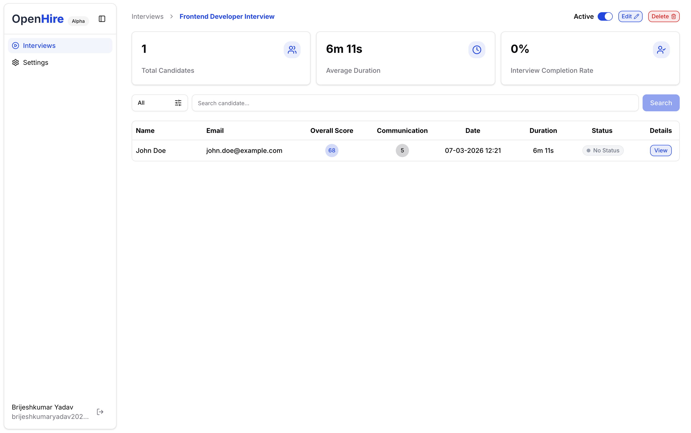
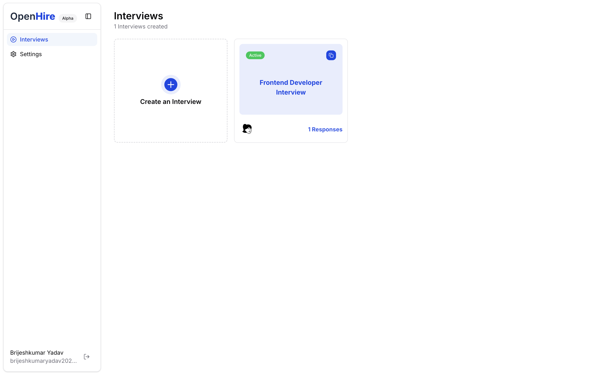
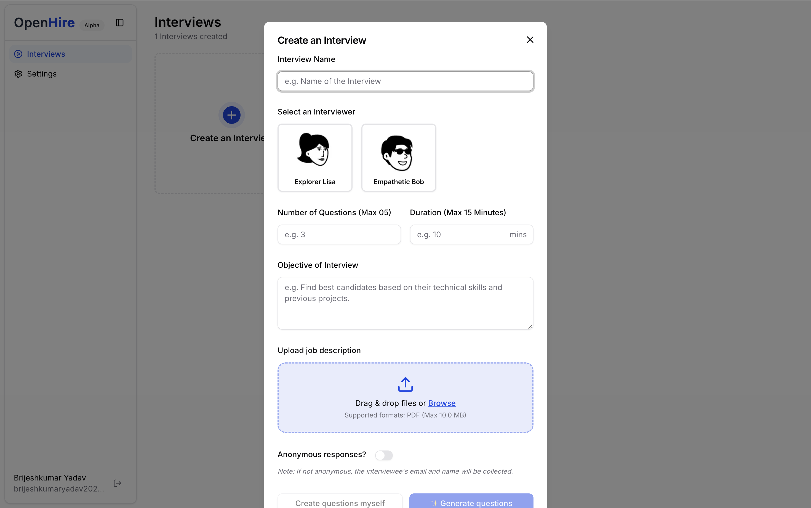
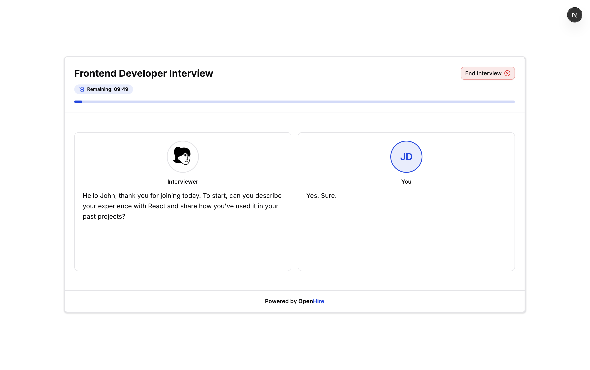
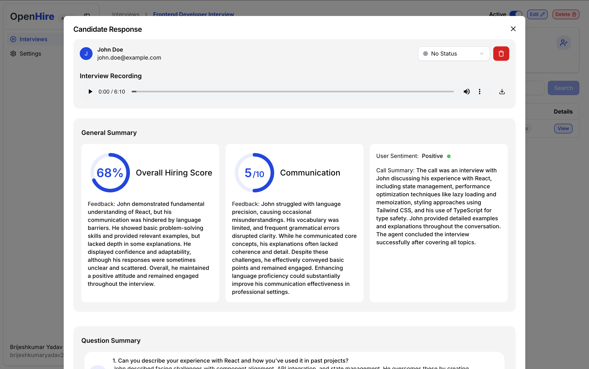

# Openhire

> ⚠️ This project is in early alpha. Expect breaking changes.

Open-source AI interviewing platform. Self-hosted.

## Screenshots

  <picture style="flex: 1; min-width: 0;">
    
  </picture>
  <picture style="flex: 1; min-width: 0;">
    
  </picture>

  <picture style="flex: 1; min-width: 0;">
    
  </picture>
  <picture style="flex: 1; min-width: 0;">
    
  </picture>

## Features
- 🎯 **Interview Creation:** Instantly generate tailored interview questions from any job description.
- 🔗 **One-Click Sharing:** Generate and share unique interview links with candidates in seconds.
- 🎙️ **AI Voice Interviews:** Let our AI conduct natural, conversational interviews that adapt to candidate responses.
- 📊 **Smart Analysis:** Get detailed insights and scores for each interview response, powered by advanced AI.
- 📈 **Comprehensive Dashboard:** Track all candidate performances and overall stats.

## Tech Stack

- Next.js 16 (App Router)
- React 19
- TypeScript
- Tailwind CSS v4 + shadcn/ui
- Drizzle ORM + Neon (Postgres) / PostgreSQL
- Better Auth
- Retell AI
- OpenAI + LangChain

## Documentation

- [Run Locally](./docs/run-locally.md)
- [Deploy](./docs/deploy.md)

## Contributing

Please read the [contributing guide](./CONTRIBUTING.md). Stars are appreciated!

## Contributors

> Made with [contrib.rocks](https://contrib.rocks)

## Acknowledgments

Inspired by [FoloUp](https://github.com/FoloUp/FoloUp).

## License

Licensed under the [MIT license](./LICENSE).
